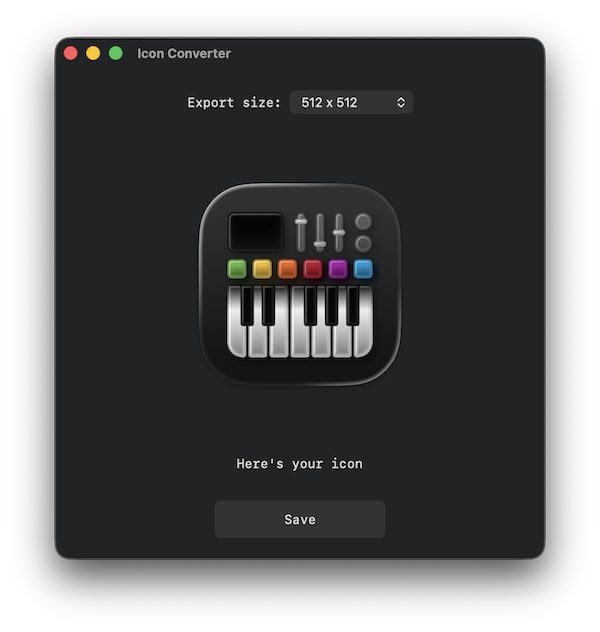

# Icon Converter

Convert macOS app bundle icon to `.png` format.



## Features

- Drop app bundle to app window
- Drop app bundle to Dock icon
- Right click app bundle in Finder and select **Extract App Icon**
- CLI tool

### Finder Extension

Add instructions how to enable.

## CLI Usage

```
iconconverter convert path/to/Example.app path/to/savelocation [--size 256]
```

### Examples

Convert Automator icon and save it to Desktop using default size 512 x 512:

```
iconconverter convert /System/Applications/Automator.app ~/Desktop
```

Convert Automator icon and save it to Desktop using size 128 x 128:

```
iconconverter convert /System/Applications/Automator.app ~/Desktop --size 128
```

## Settings

Read app settings:

```
defaults read ~/Library/Containers/com.github.IconConverter/Data/Library/Preferences/com.github.IconConverter.plist"
```

Note! App settings `exportSize` is half of what is actually displayed in GUI.
